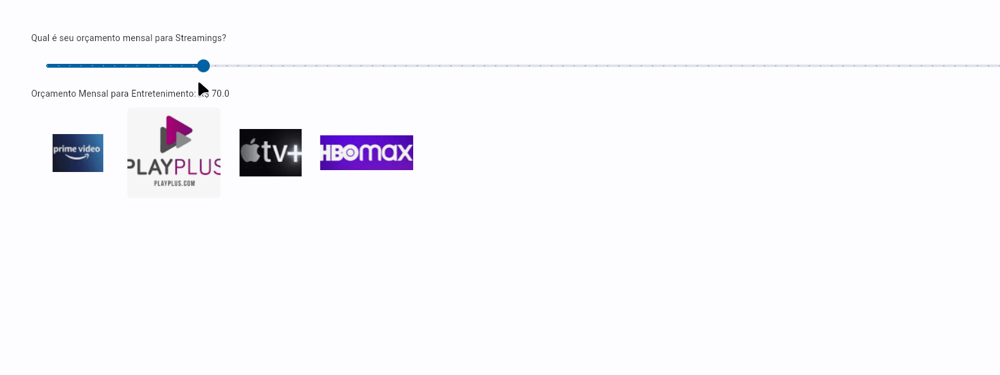

# Buscador de Preço para Streamings

A grana está curta, e não sabe o que assinar? Sem problemas acabaram hehehe!

Baseado no orçamento mensal do usuário, o software lista quais são os serviços de streamings que podem ser assinados. Para isso, mantém atualizados em sua base de dados os valores das mensalidades dos principais serviços de Streamings encontrados no Brasil.

## Demo



## Instalação

Extraia o zip baixado através do link https://github.com/IgorAvilaPereira/BuscadorPrecosStreaming/archive/refs/heads/main.zip
<!--
2) Cole database.db na pasta **/dist**. 
3) O executável está na pasta **/dist**. 
4) Execute o arquivo executável clicando 2x. 
-->

<!-- ## Gere um executável:-->

1) Instale o Python.
2) Vá por terminal até a pasta do projeto
3) E digite:

```
pip install -r requirements
pip install pyinstaller
flet pack app.py
```
O executável será gerado dentro da pasta **/dist**.

Antes de executá-lo, cole **database.db** na pasta **/dist**. 

Se for windows: **dist\main.exe**

Se for Linux: **dist/main**
